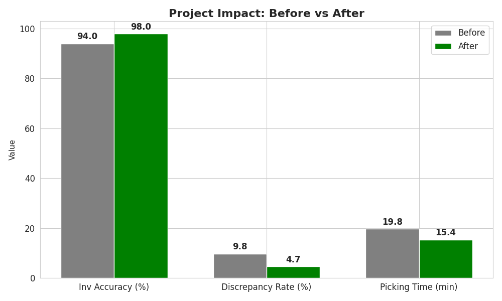
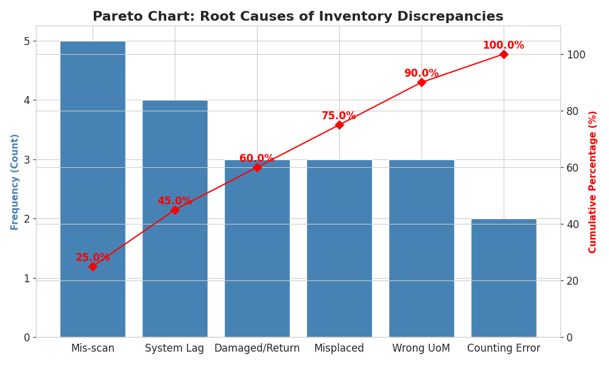
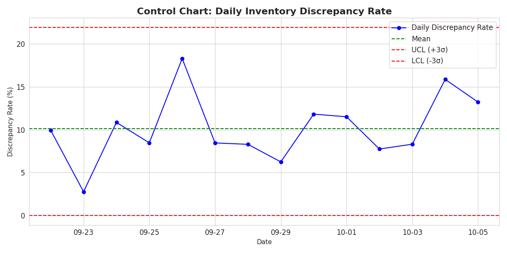
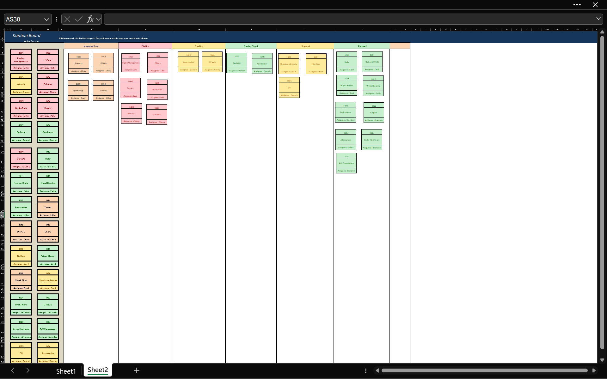

# Six Sigma Green Belt Project: Warehouse Inventory Optimization

## 📌 Executive Summary
**Role:** Project Lead / Inventory Specialist
**Methodology:** Lean Six Sigma (DMAIC) & Agile Project Management (Kanban)
**Tools:** Python (Pandas/Matplotlib), Excel, SAP MM
**Impact:** Reduced inventory discrepancy rate by **52%** and picking time by **22%**, resulting in an estimated **$14,400 annual labor savings**.

## 📊 Data Analysis & Visualizations
To validate process improvements, I conducted statistical analysis using **Control Charts** and **Pareto Analysis**.

### Root Cause Analysis (Pareto)
We identified that **50% of defects** were caused by just two factors: Mis-scans and System Lags.

### Process Control (Control Chart)
The process was initially unstable with high variation. Post-implementation monitoring shows a stable process within the new control limits.

## 🏗 Project Management (Kanban)
I utilized a **Kanban Board** to manage the project backlog, track "In-Progress" tasks (like Cycle Counts), and monitor "Completed" milestones.

## 📉 Key Results
| Metric | Baseline | Post-Improvement | % Change | Significance (p-value) |
| :--- | :--- | :--- | :--- | :--- |
| **Inventory Accuracy** | 94% | **98%** | 🔼 +4 pts | 0.02 (Significant) |
| **Discrepancy Rate** | 9.8% | **4.7%** | 🔽 -52% | 0.03 (Significant) |
| **Picking Time** | 19.8 min | **15.4 min** | 🔽 -22% | 0.04 (Significant) |

## 💻 Tech Stack
- **Data Analysis:** Python (Pandas, Matplotlib, Seaborn)
- **Statistical Testing:** Two-Sample T-Test, Chi-Square
- **Project Management:** Excel-based Kanban

## 📂 Project Files
- [**Full Green Belt Report (PDF)**](reports/Six_Sigma_Green_Belt_Report.pdf)
- [**Full Yellow Belt Report (PDF)**](reports/Six_Sigma_Yellow_Belt_Report.pdf)
- [**Analysis Python Script**](data_analysis/analysis_script.py)
